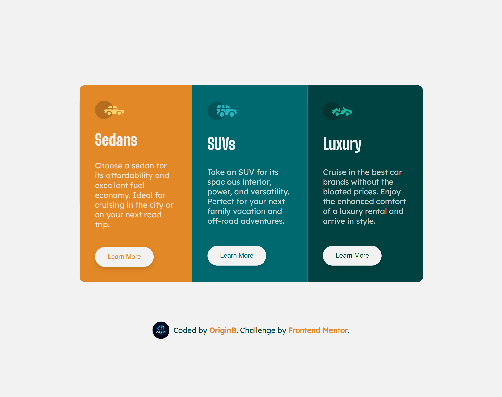

# 🚗 3 Column Preview Card

A responsive 3-column preview card component built with pure **HTML** and **CSS**, as part of a [Frontend Mentor](https://www.frontendmentor.io) challenge.

---

## 📸 Screenshots

### 📱 Mobile


### 🖥️ Desktop



---

## 🔗 Links

- **Live Site:** [View Demo](https://origin-b.github.io/Frontend-Challenges/3-Column-Preview-Card/) _(update with your URL)_
- **GitHub Repo:** [github.com/Origin-B](https://github.com/Origin-B)

---

## 🛠️ Built With

- Semantic **HTML5**
- **CSS3** — Flexbox, CSS Variables, Media Queries
- **Google Fonts** — [Big Shoulders Display](https://fonts.google.com/specimen/Big+Shoulders+Display) & [Lexend Deca](https://fonts.google.com/specimen/Lexend+Deca)
- Mobile-first workflow

---

## ✨ Features

- ✅ Fully responsive — adapts from mobile to desktop
- ✅ Semantic `<article>` elements with descriptive class names
- ✅ Creative `inset box-shadow` hover effect on buttons
- ✅ Accessible buttons with `aria-label`
- ✅ Single optimized Google Fonts request

---

## 🧠 What I Learned

- Using **semantic class names** (`.card-sedan`, `.card-suv`, `.card-luxury`) instead of fragile `nth-of-type` selectors for more maintainable CSS
- Creating a smooth **inset `box-shadow` fill animation** on hover as a creative alternative to `background-color` transitions
- Loading multiple Google Fonts in a **single `<link>` request** for better performance
- Combining **CSS Variables** with class-based theming for a consistent color system

---

## 🚀 Getting Started

Clone the repository and open `index.html` in your browser:

```bash
git clone https://github.com/Origin-B/Frontend-Challenges/tree/main/3-Column-Preview-Card
cd 3-column-preview-card
open index.html
```

No build tools or dependencies required.

---

## 👤 Author

- GitHub — [@Origin-B](https://github.com/Origin-B)
- Frontend Mentor — [@Origin-B](https://www.frontendmentor.io/profile/Origin-B)

---

## 🙏 Acknowledgments

Challenge provided by [Frontend Mentor](https://www.frontendmentor.io).
