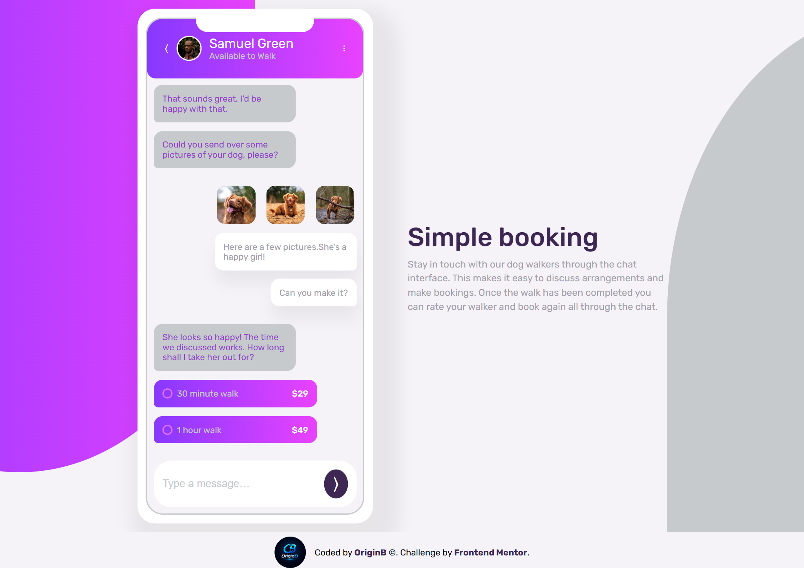
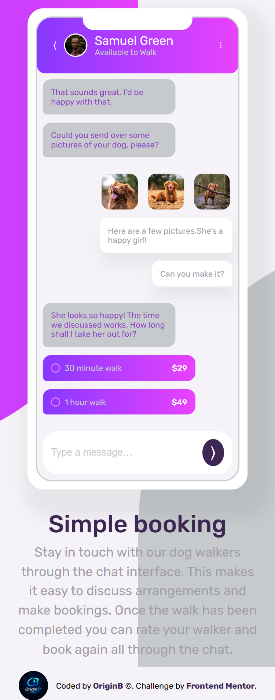

# Chat App CSS Illustration

## Screenshot

## Links
- [Live Site](https://origin-b.github.io/Frontend-Challenges/Chat-App-Css/)
- [GitHub Repository](https://github.com/Origin-B/Frontend-Challenges/tree/main/Chat-App-Css)

## Built With
- HTML
- CSS
- BEM Naming Convention
- CSS Custom Properties
- CSS Positioning & Pseudo-elements

## What I Learned

### Accessibility
- Using `aria-label` to describe buttons, links, and inputs that lack visible text
- Writing descriptive `alt` attributes for images — important for both SEO and accessibility

### Semantic HTML
- The ideal semantic structure: Header, Main, Footer, Nav
- When and why to use each semantic element

### Forms
- Linking `<label>` to `<input>` using the `id` attribute
- The difference between `name`, `id`, and `value`
- Using `name` to group radio buttons together
- The difference between `radio` and `checkbox`

## Resources
- [Frontend Mentor Challenge](https://www.frontendmentor.io/challenges/chat-app-css-illustration-O5auMkFqY)
- [MDN - ARIA](https://developer.mozilla.org/en-US/docs/Web/Accessibility/ARIA)
- [MDN - Forms](https://developer.mozilla.org/en-US/docs/Web/HTML/Element/form)