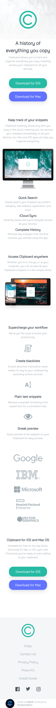

# Clipboard Landing Page

## Screenshot

## Links
- [Live Site](https://origin-b.github.io/Frontend-Challenges/Clipboard-Landing-Page/)
- [GitHub Repository](https://github.com/Origin-B)

## Built With
- HTML
- CSS

## What I Learned
- Not everything needs to be centered with Flexbox — elements like headings and paragraphs can be centered with `text-align`
- Adding a negative `margin` is like increasing the element's width by that value
- `translate` moves an element without affecting surrounding elements, while `margin` adds actual space between elements
- `gap` replaces `margin` inside Flexbox and Grid containers
- The default value for `width` and `height` is `fit-content` when not specified
- Flexbox is for single rows or columns, while Grid is for working with rows and columns together

## Resources
- [Frontend Mentor Challenge](https://www.frontendmentor.io/challenges/clipboard-landing-page-5cc9bccd6c4c91111378ecb9)
- [MDN Web Docs](https://developer.mozilla.org)
