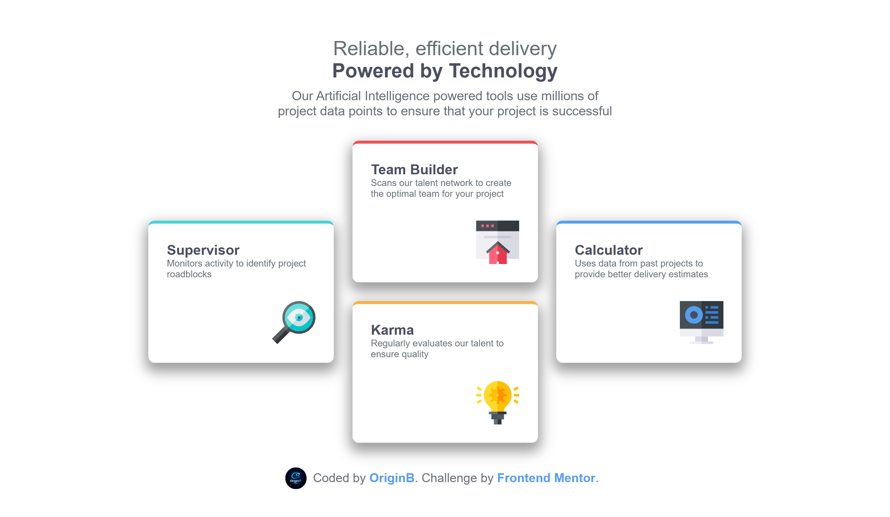
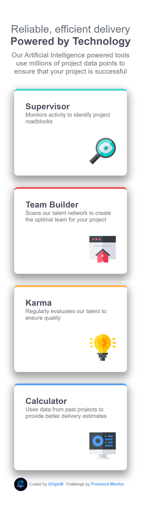

# Four Card Feature Section

## Overview

A responsive Four Card Feature Section built with pure HTML and CSS. This is a solution to the [Four Card Feature Section challenge](https://www.frontendmentor.io/challenges/four-card-feature-section-weK1eFYK) on Frontend Mentor.

## The Challenge

Users should be able to:

- View the optimal layout for the interface depending on their device's screen size

## Built With

- Semantic HTML5
- CSS Custom Properties (Variables)
- Flexbox
- CSS Grid
- Google Fonts — [Poppins](https://fonts.google.com/specimen/Poppins)
- Mobile-first workflow

## Features

- ✅ Fully responsive (Mobile & Desktop)
- ✅ CSS Grid with spanning cards for desktop layout
- ✅ Color-coded border-top per card
- ✅ CSS Variables for consistent theming
- ✅ Subtle box shadow for card depth

## Screenshots

| Mobile                                | Desktop                                 |
| ------------------------------------- | --------------------------------------- |
|  |  |

## Author

- GitHub — [@Origin-B](https://github.com/Origin-B)
- Frontend Mentor — [@Origin-B](https://www.frontendmentor.io/profile/Origin-B)

## Acknowledgments

Challenge by [Frontend Mentor](https://www.frontendmentor.io).
