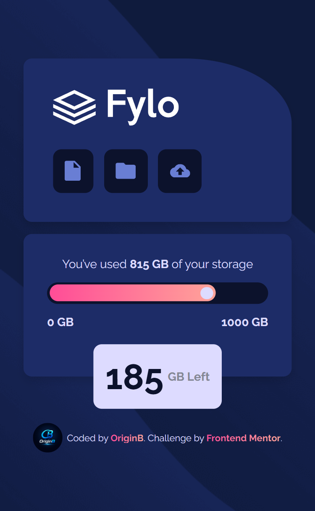

# 🗄️ Fylo Data Storage Component

A responsive data storage component built with pure **HTML** and **CSS**, as part of a [Frontend Mentor](https://www.frontendmentor.io) challenge.

---

## 📸 Screenshots

### 📱 Mobile



### 🖥️ Desktop


---

## 🔗 Links

- **Live Site:** [View Demo](https://origin-b.github.io/Fylo-Data-Storage) _(update with your URL)_
- **GitHub Repo:** [github.com/Origin-B](https://github.com/Origin-B)

---

## 🛠️ Built With

- Semantic **HTML5**
- **CSS3** — Flexbox, CSS Variables, Pseudo-elements, Media Queries
- **Google Fonts** — [Raleway](https://fonts.google.com/specimen/Raleway)
- Mobile-first workflow

---

## ✨ Features

- ✅ Fully responsive — adapts from mobile to desktop
- ✅ Custom progress bar built entirely with CSS `::before` & `::after`
- ✅ Tooltip repositions dynamically between mobile and desktop layouts
- ✅ Background image switches based on screen size
- ✅ Gradient text effect on attribution links
- ✅ Semantic class names for maintainable CSS

---

## 🧠 What I Learned

- Building a **custom progress bar** using only CSS pseudo-elements — no extra HTML needed
- Using **`position: absolute`** with `translate` to dynamically reposition elements across breakpoints
- Creating a **CSS triangle** with `border` trick for the tooltip arrow on desktop
- Applying **gradient text** using `background-clip: text` with `color: transparent`
- Using **semantic class names** instead of fragile `nth-of-type` selectors for more maintainable CSS

---

## 🚀 Getting Started

Clone the repository and open `index.html` in your browser:

```bash
git clone https://github.com/Origin-B/Fylo-Data-Storage.git
cd Fylo-Data-Storage
open index.html
```

No build tools or dependencies required.

---

## 👤 Author

- GitHub — [@Origin-B](https://github.com/Origin-B)
- Frontend Mentor — [@Origin-B](https://www.frontendmentor.io/profile/Origin-B)

---

## 🙏 Acknowledgments

Challenge provided by [Frontend Mentor](https://www.frontendmentor.io).
