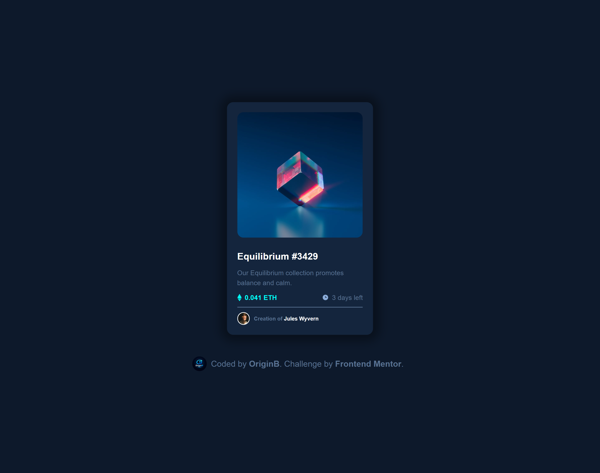
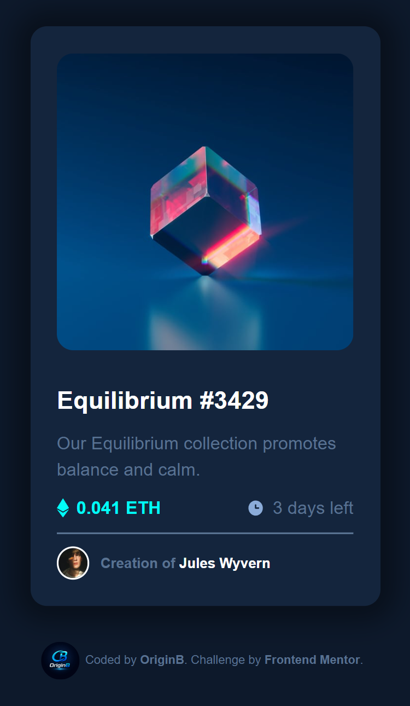

# NFT Preview Card Component

## Overview

A responsive NFT Preview Card Component built with pure HTML and CSS. This is a solution to the [NFT Preview Card Component challenge](https://www.frontendmentor.io/challenges/nft-preview-card-component-SbdUL_w0U) on Frontend Mentor.

## The Challenge

Users should be able to:

- View the optimal layout depending on their device's screen size
- See hover states for interactive elements

## Built With

- Semantic HTML5
- CSS Custom Properties (Variables)
- Flexbox
- Google Fonts — [Outfit](https://fonts.google.com/specimen/Outfit)
- Mobile-first workflow

## Features

- ✅ Fully responsive (Mobile & Desktop)
- ✅ Cyan overlay with eye icon on image hover
- ✅ Hover color transitions on title and creator name
- ✅ CSS Variables for consistent dark theme
- ✅ Clean box shadow for card depth

## Screenshots

| Mobile                                | Desktop                                 |
| ------------------------------------- | --------------------------------------- |
|  |  |

## Author

- GitHub — [@Origin-B](https://github.com/Origin-B)
- Frontend Mentor — [@Origin-B](https://www.frontendmentor.io/profile/Origin-B)

## Acknowledgments

Challenge by [Frontend Mentor](https://www.frontendmentor.io).
