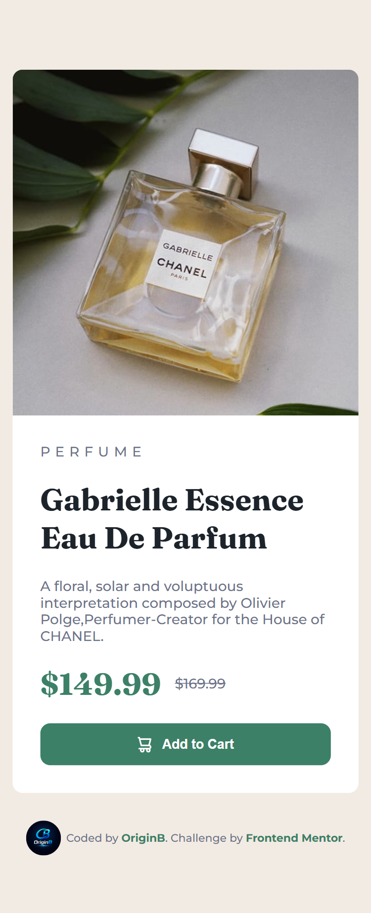

# 🌸 Product Preview Card

A clean and responsive product preview card built with pure **HTML** and **CSS**, as part of a [Frontend Mentor](https://www.frontendmentor.io) challenge.

---

## 📸 Screenshots

### 📱 Mobile



### 🖥️ Desktop


---

## 🔗 Links

- **Live Site:** [View Demo](https://origin-b.github.io/Frontend-Challenges/Product-Preview-Card) _(update with your URL)_
- **GitHub Repo:** [github.com/Origin-B](https://github.com/Origin-B)

---

## 🛠️ Built With

- Semantic **HTML5**
- **CSS3** — Flexbox, CSS Variables, Media Queries
- **Google Fonts** — [Fraunces](https://fonts.google.com/specimen/Fraunces) & [Montserrat](https://fonts.google.com/specimen/Montserrat)
- Mobile-first workflow

---

## ✨ Features

- ✅ Fully responsive — adapts from mobile to desktop
- ✅ Semantic HTML with proper heading hierarchy
- ✅ Accessible button with `aria-label`
- ✅ Smooth hover transitions on interactive elements
- ✅ DRY CSS using reusable utility classes and CSS Variables

---

## 🧠 What I Learned

- How to use **CSS Variables** for consistent theming across a project
- Using **`background-image`** with `background-size: cover` for responsive image sections
- Switching between mobile and desktop images using **Media Queries**
- Applying the **DRY principle** in CSS by creating reusable classes like `.fraunces`

---

## 🚀 Getting Started

Clone the repository and open `index.html` in your browser:

```bash
git clone https://github.com/Origin-B/Frontend-Challenges/tree/main/Product-Preview-Card
cd product-preview-card
open index.html
```

No build tools or dependencies required.

---

## 👤 Author

- GitHub — [@Origin-B](https://github.com/Origin-B)
- Frontend Mentor — [@Origin-B](https://www.frontendmentor.io/profile/Origin-B)

---

## 🙏 Acknowledgments

Challenge provided by [Frontend Mentor](https://www.frontendmentor.io).
