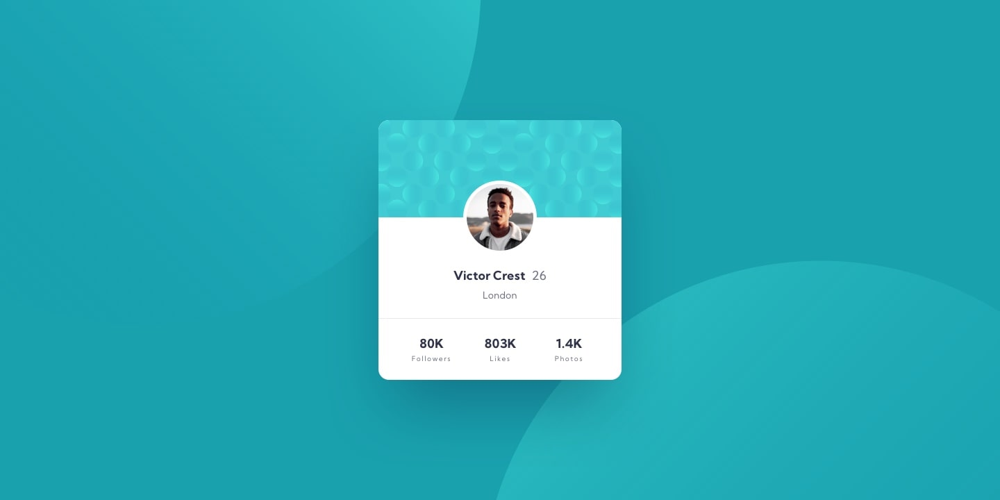

# 👤 Profile Card Component

A responsive profile card component built with pure **HTML** and **CSS**, as part of a [Frontend Mentor](https://www.frontendmentor.io) challenge.

---

## 📸 Screenshots

### 🖥️ Desktop



### 📱 Mobile


---

## 🔗 Links

- **Live Site:** [View Demo](https://origin-b.github.io/Frontend-Challenges/Profile-Card-Component/)
- **GitHub Repo:** [github.com/Origin-B](https://github.com/Origin-B/Frontend-Challenges/tree/main/Profile-Card-Component)

---

## 🛠️ Built With

- Semantic **HTML5**
- **CSS3** — Flexbox, CSS Variables, Media Queries
- **Google Fonts** — [Kumbh Sans](https://fonts.google.com/specimen/Kumbh+Sans)
- Mobile-first workflow

---

## ✨ Features

- ✅ Fully responsive — adapts from mobile to desktop
- ✅ Decorative background circles positioned precisely using percentage-based `background-position`
- ✅ Profile image overlapping the card header using `position: absolute`
- ✅ Semantic HTML with `<article>` elements for content sections
- ✅ Accessible images with descriptive `alt` attributes

---

## 🧠 What I Learned

- Using **percentage-based `background-position`** values (e.g. `-120% -20%`) to position decorative patterns that adapt automatically to any screen size — no `calc()` or fixed pixels needed
- Overlapping elements across section boundaries using **`position: absolute`** with `translate`
- How **`overflow: hidden`** on the parent card clips child elements cleanly
- Keeping media queries minimal by choosing the right unit from the start

---

## 💬 What I'm Most Proud Of

Solving the background pattern positioning using percentage values instead of fixed pixels. By using `-120% -20%` and `250% 120%`, the two decorative circles adapt automatically to any screen size — a simpler and smarter solution than `calc()`.

---

## 🔄 What I'd Do Differently

I'd fine-tune the percentage values more carefully from the start instead of trial and error. Next time I'd think in percentages first rather than jumping to pixel values, which saves a lot of back and forth.

---

## 🚀 Getting Started

Clone the repository and open `index.html` in your browser:

```bash
git clone https://github.com/Origin-B/Frontend-Challenges
cd Profile-Card-Component
open index.html
```

No build tools or dependencies required.

---

## 👤 Author

- GitHub — [@Origin-B](https://github.com/Origin-B)
- Frontend Mentor — [@Origin-B](https://www.frontendmentor.io/profile/Origin-B)

---

## 🙏 Acknowledgments

Challenge provided by [Frontend Mentor](https://www.frontendmentor.io).
