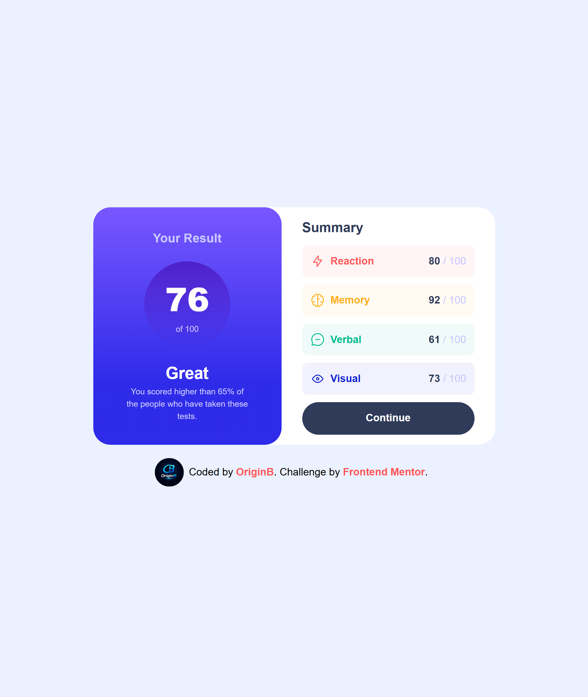
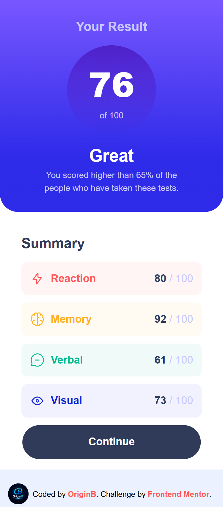

# Results Summary Component

## Overview

A responsive Results Summary Component built with pure HTML and CSS. This is a solution to the [Results Summary Component challenge](https://www.frontendmentor.io/challenges/results-summary-component-CE_K6s0maV) on Frontend Mentor.

## The Challenge

Users should be able to:

- View the optimal layout for the interface depending on their device's screen size
- See hover and focus states for all interactive elements on the page

## Built With

- Semantic HTML5
- CSS Custom Properties (Variables)
- Flexbox
- CSS Gradients
- Google Fonts — [Hanken Grotesk](https://fonts.google.com/specimen/Hanken+Grotesk)
- Mobile-first workflow

## Features

- ✅ Fully responsive (Mobile & Desktop)
- ✅ Smooth hover transition on the Continue button
- ✅ CSS Variables for consistent theming
- ✅ Clean, semantic markup

## Screenshots

| Mobile                                | Desktop                                 |
| ------------------------------------- | --------------------------------------- |
|  |  |

## Author

- GitHub — [@Origin-B](https://github.com/Origin-B)
- Frontend Mentor — [@Origin-B](https://www.frontendmentor.io/profile/Origin-B)

## Acknowledgments

Challenge by [Frontend Mentor](https://www.frontendmentor.io).
